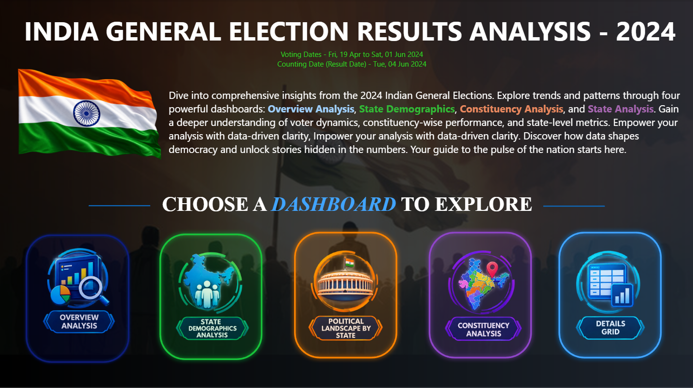
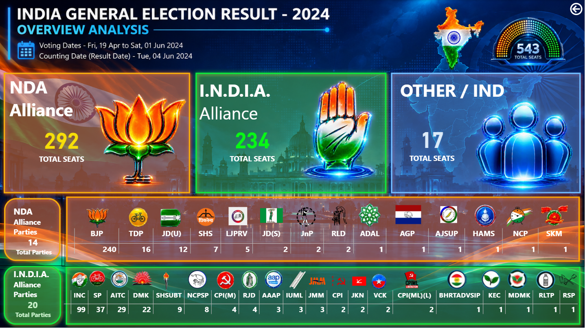
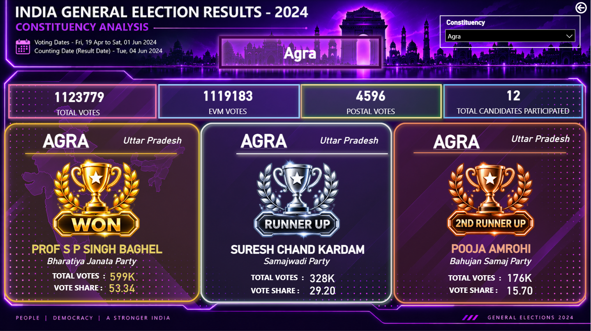

# 🗳️ Election Analytics Dashboard | Power BI

> An interactive Power BI solution for analyzing real-world election data across states, constituencies, political parties, candidates, and alliances.

This project transforms multiple real-world election datasets into an interactive **Business Intelligence and Data Analytics solution** using **Microsoft Power BI, Power Query, DAX, data modeling, data enrichment, and interactive visual analytics**.

The dashboard enables users to move from a high-level election overview to detailed **state, party, alliance, constituency, candidate, vote, and margin-level analysis** within a unified analytical environment.

---
## 📸 Dashboard Preview

### Dashboard Navigation


### Overview Analysis


### Constituency Analysis


---
## 📊 Project Overview

Election data is distributed across multiple levels of granularity, including candidate-level voting records, constituency results, state-level information, and party-wise outcomes.

This project integrates these datasets into a structured Power BI data model to create an interactive analytical solution for exploring election outcomes from both **high-level and granular perspectives**.

### Key Analytical Areas

- 🗺️ State-wise election analysis
- 🏛️ Constituency-level results
- 🏴 Political party performance
- 🤝 Alliance-level analysis
- 👤 Candidate-level analysis
- 🥇 Winning candidate analysis
- 🥈 Runner-up analysis
- 🥉 Second runner-up analysis
- 🗳️ EVM vs Postal vote analysis
- 📊 Vote share analysis
- 📈 Winning margin analysis
- 🌍 Geographic election analysis
- 📋 Detailed election-result exploration

---

## 🎯 Project Objectives

The project was developed to:

- Integrate multiple election datasets into a unified analytical environment
- Clean and transform raw election data
- Build a structured relational data model
- Establish relationships between election entities
- Enrich source data with additional analytical classifications
- Develop dynamic calculations using DAX
- Create meaningful KPIs and analytical measures
- Enable interactive state, constituency, party, candidate, and alliance analysis
- Visualize complex election datasets through intuitive dashboards
- Provide a structured framework for extracting analytical insights

---

## 🔄 End-to-End Data Analytics Workflow

    Real-World Election Data
              │
              ▼
    Multiple CSV Datasets
              │
              ▼
    Data Cleaning & Transformation
              │
              ▼
    Data Integration & Modeling
              │
              ▼
    Manual Data Enrichment
              │
              ▼
    Alliance Classification
              │
              ▼
    DAX Measures & Calculations
              │
              ▼
    KPI & Visual Development
              │
              ▼
    Interactive Power BI Dashboard
              │
              ▼
    Multi-Level Election Analysis

---

## 🗂️ Data Sources

The project uses multiple CSV datasets representing different levels of election information.

| Dataset | Analytical Purpose |
|---|---|
| `Constituency-wise-results.csv` | Constituency-level winning candidates, total votes, winning margins, constituency and party identifiers |
| `Constituency-wise-details.csv` | Candidate-level EVM votes, postal votes, total votes and vote share |
| `State-wise-results.csv` | State and constituency-level election results, leading/trailing candidates and winning margins |
| `Party-wise-results.csv` | Party-level election performance and seats won |
| `States.csv` | State identifiers and state-name mapping |

These datasets are integrated within Power BI to support analysis across multiple dimensions and levels of granularity.

---

## 🧹 Data Preparation & Transformation

The raw CSV datasets are transformed into analysis-ready data before being used in the Power BI model.

### Data Preparation Activities

- Data ingestion from multiple CSV sources
- Data type standardization
- Column transformation
- Data consistency handling
- Key-field preparation
- State and constituency mapping
- Candidate-level data preparation
- Party-level data integration
- Data relationship preparation
- Analytical field preparation

**Power Query** is used as the primary data transformation and preparation layer.

---

## 🧩 Data Enrichment — Alliance Classification

An important analytical enhancement in this project is the addition of **Alliance classification**.

The original source datasets did **not** contain an explicit alliance field.

To enable alliance-level analysis, an **Alliance attribute was manually added as an analytical enrichment** based on the relevant party classification.

### This enrichment enables:

- Alliance-level seat analysis
- Alliance comparison
- State-wise alliance analysis
- Constituency-level alliance identification
- Party-to-alliance grouping
- Alliance-based filtering
- Alliance-level visualizations

The analytical workflow therefore becomes:

    Original Source Data
            ↓
    Data Transformation
            ↓
    Manual Alliance Enrichment
            ↓
    Power BI Data Model
            ↓
    Alliance-Level Analysis

> **Important:** The manually added Alliance classification is an analytical enrichment and is not represented as an original field in the source CSV datasets.

---

## 🏗️ Data Model

The Power BI solution brings together multiple analytical entities representing different levels of election data.

### Core Entities

- Constituency-wise Results
- Constituency-wise Details
- State-wise Results
- States
- Party-wise Results
- Party / Alliance classification

The model supports analysis across:

    State
      │
      ├── Constituency
      │       │
      │       ├── Candidates
      │       ├── Votes
      │       ├── Vote Share
      │       └── Winning Margin
      │
      └── Party
              │
              └── Alliance

The data model is designed to support **relationship-based analysis, aggregation, filtering, drill-down, and cross-dimensional exploration**.

---

## 📑 Dashboard Architecture

The Power BI report contains **six analytical pages**, each designed for a specific analytical purpose.

### 1. 🏠 India Elections Result

The landing page provides the primary navigation experience for the dashboard.

#### Purpose

- Dashboard introduction
- Navigation between analytical sections
- Structured user experience
- Entry point for election analysis

---

### 2. 📊 Overview Analysis

The Overview Analysis page provides a high-level view of **party and alliance performance**.

#### Analysis Includes

- Party-wise seat comparison
- Alliance-level seat analysis
- Total seats by alliance
- Party-level breakdown
- Comparative election overview

The alliance analysis includes classifications such as:

- `NDA`
- `I.N.D.I.A.`
- `OTHER`

This enables users to examine election outcomes at both the **party and alliance level**.

---

### 3. 🗺️ State Demographics Analysis

This page provides a geographic perspective of election outcomes.

#### Key Analytical Elements

- State-level maps
- Constituency-level geographic analysis
- Alliance-based geographic analysis
- Winning candidate information
- Winning party information
- State and constituency exploration

Interactive geographic visuals allow users to explore how election outcomes vary across different regions.

---

### 4. 🏛️ Political Landscape by State

This page focuses on the political composition of individual states.

#### Key Components

- State selection
- State-level analysis
- Party-wise seat analysis
- Alliance-wise seat analysis
- Party distribution
- Treemap-based analysis
- Comparative party and alliance analysis

Users can move from a broad national view to a **state-specific political landscape**.

---

### 5. 🎯 Constituency Analysis

The Constituency Analysis page provides detailed analysis of an individual constituency.

#### Key Metrics and Attributes

- Total Votes
- EVM Votes
- Postal Votes
- Total Candidates Participated
- Winning Candidate
- Winning Party
- State
- Constituency
- Trailing Candidate
- Runner-up Party
- Runner-up Total Votes
- Runner-up Vote Share
- Second Runner-up Party
- Second Runner-up Total Votes
- Second Runner-up Vote Share

This page enables detailed examination of an individual constituency's electoral outcome.

---

### 6. 📋 Details Grid

The Details Grid provides a structured tabular view of election information.

#### Key Fields

- Constituency Name
- Winning Candidate
- Trailing Candidate
- EVM Votes
- Postal Votes
- Total Votes
- Winning Margin
- Party
- Alliance
- State

Interactive filtering allows users to narrow the analysis and examine constituency-level records in detail.

---

## 📌 Key KPIs & Metrics

The dashboard incorporates analytical metrics across multiple dimensions.

### Election & Party

- Total Seats
- Seats Won
- Party-level performance
- Alliance-level performance

### Voting

- Total Votes
- EVM Votes
- Postal Votes
- Vote Share

### Candidate

- Total Candidates Participated
- Winning Candidate
- Trailing Candidate
- Runner-up
- Second Runner-up

### Constituency

- Winning Party
- Winning Margin
- Runner-up Vote Share
- Second Runner-up Vote Share

### Geography

- State
- Constituency
- State-wise party distribution
- State-wise alliance distribution

---

## 🧮 DAX & Analytical Logic

**DAX (Data Analysis Expressions)** is used to develop dynamic analytical calculations within the Power BI model.

The analytical layer supports calculations and measures related to:

- Total votes
- Seat counts
- Party performance
- Alliance performance
- Candidate participation
- Winning margins
- Runner-up performance
- Vote share
- Constituency selection
- State-level aggregation
- Party-level aggregation
- Alliance-level aggregation

The measures dynamically respond to dashboard selections and filters, allowing users to perform interactive analysis rather than relying on static calculations.

---

## 🎨 Interactive Dashboard Features

The dashboard uses Power BI's interactive capabilities to support exploratory analysis.

### Features Include

- Interactive slicers
- Cross-filtering
- Dynamic KPI cards
- Interactive maps
- Filled maps
- Treemaps
- Tables
- Detailed grids
- Drill-down analysis
- Page navigation
- State filtering
- Constituency filtering
- Party filtering
- Alliance filtering
- Dynamic visual interactions

The dashboard is designed as an **interactive analytical application rather than a static report**.

---

## 🔍 Analytical Questions Supported

The dashboard enables users to investigate questions such as:

### Party & Alliance

- How are seats distributed across political parties?
- How are seats distributed across alliances?
- How does party performance vary by state?
- How does alliance composition vary across states?

### State

- What is the political landscape of a selected state?
- Which parties won seats within a state?
- How are alliances distributed geographically?
- How does party representation vary between states?

### Constituency

- Who won a particular constituency?
- Which party did the winning candidate represent?
- What was the winning margin?
- How many candidates participated?
- What were the EVM and postal vote totals?
- Who was the runner-up?
- What was the runner-up vote share?
- Who was the second runner-up?
- What was the second runner-up vote share?

### Voting

- How are votes distributed across candidates?
- How do EVM and postal votes contribute to total votes?
- How does vote share vary between candidates?
- How do winning margins differ across constituencies?

---

## 💡 Analytical Value

The project demonstrates how multiple datasets with different levels of granularity can be transformed into a unified **Business Intelligence solution**.

Instead of analyzing individual CSV files separately, the dashboard provides a layered analytical experience:

    National Overview
           ↓
    Alliance Analysis
           ↓
    State-Level Analysis
           ↓
    Party-Level Analysis
           ↓
    Constituency Analysis
           ↓
    Candidate-Level Analysis
           ↓
    Detailed Election Records

This structure allows users to move seamlessly between **summary-level analysis and granular election investigation**.

---

## 🛠️ Technology Stack

| Area | Technology |
|---|---|
| Business Intelligence | Microsoft Power BI |
| Data Transformation | Power Query |
| Analytical Language | DAX |
| Data Sources | CSV |
| Data Modeling | Power BI Data Model |
| Data Visualization | Power BI |
| Version Control | Git & GitHub |

---

## 🧠 Skills Demonstrated

This project demonstrates practical application of:

- Data Analytics
- Business Intelligence
- Power BI
- Power Query
- DAX
- Data Cleaning
- Data Transformation
- Data Integration
- Data Modeling
- Relational Data Modeling
- Data Enrichment
- Analytical Dimension Creation
- KPI Development
- Interactive Dashboard Development
- Geographic Data Visualization
- Election Analytics
- Candidate Analysis
- Party Analysis
- Alliance Analysis
- Constituency Analysis
- State-wise Analysis
- Data Visualization
- Analytical Storytelling
- Data-driven Insight Generation

---

## 📁 Repository Structure

    election-analytics-powerbi-dashboard/
    │
    ├── README.md
    │
    ├── election-dashboard.pbix
    │
    ├── Constituency-wise-details.csv
    ├── Constituency-wise-results.csv
    ├── Party-wise-results.csv
    ├── State-wise-results.csv
    └── States.csv

---

## 🚀 How to Use

### Requirements

- Microsoft Power BI Desktop
- Source CSV datasets included in the repository

### Steps

1. Clone or download this repository.
2. Open `election-dashboard.pbix` using Power BI Desktop.
3. Check the data-source paths configured in Power Query.
4. Update the CSV file paths if they differ on your machine.
5. Refresh the dataset.
6. Navigate through the six dashboard pages.
7. Use the available slicers, filters, maps, and interactive visuals to explore the election data.

---

## 🔁 Reproducibility

The project follows an end-to-end analytical workflow:

    CSV Source Data
          ↓
    Power Query
          ↓
    Data Preparation
          ↓
    Manual Data Enrichment
          ↓
    Data Model
          ↓
    DAX Measures
          ↓
    Power BI Visualizations
          ↓
    Interactive Analysis

The CSV datasets used by the report are included in the repository to provide transparency into the underlying data sources.

When opening the Power BI report on another machine, the local source paths may need to be updated in Power Query before refreshing the report.

---

## 📚 Data Structure

The project combines multiple levels of data granularity:

| Analytical Level | Dataset |
|---|---|
| Candidate | `Constituency-wise-details.csv` |
| Constituency Result | `Constituency-wise-results.csv` |
| State / Constituency | `State-wise-results.csv` |
| Party | `Party-wise-results.csv` |
| Geographic Mapping | `States.csv` |
| Alliance Classification | Manually enriched within the analytical model |

This structure enables analysis from **individual candidate voting records to constituency, state, party, and alliance-level outcomes**.

---

## 🔐 Data Transparency

The project clearly separates different stages of the analytical workflow.

### 1. Source Data

Original election records contained in the CSV datasets.

### 2. Transformation Layer

Cleaning, restructuring, preparation, and integration performed through Power Query.

### 3. Analytical Enrichment

Manual alliance classification added to support alliance-level analysis.

### 4. Analytical Layer

DAX measures, KPIs, aggregations, calculated logic, and filtering.

### 5. Presentation Layer

Power BI dashboards, maps, tables, KPI cards, slicers, and interactive visualizations.

---

## ⚠️ Data Enrichment & Alliance Classification

The underlying election datasets contain real-world election data; however, the original CSV structure did not include a dedicated `Alliance` field.

To enable alliance-level analysis, the relevant **real-world alliance information was researched and mapped to the corresponding political parties**. This information was then incorporated into the Power BI model through a **DAX-based calculated column**.

### Data Enrichment Process

```text
Original Election Data
        ↓
Identify Party Information
        ↓
Research Corresponding Real-World Alliance
        ↓
Create Party-to-Alliance Mapping
        ↓
Implement Alliance Classification using DAX
        ↓
Alliance-Level Analysis in Power BI
---

## 👤 Author

### Lakshpreet

**Data Analyst | Data Science Student**

### Areas of Interest

- Data Analytics
- Data Science
- Business Intelligence
- Power BI
- Data Visualization
- Python
- SQL
- Statistical Analysis

---

## 🔑 Technologies & Keywords

`Power BI` · `DAX` · `Power Query` · `Business Intelligence` · `Data Analytics` · `Election Analytics` · `Election Dashboard` · `Indian Elections` · `Data Visualization` · `Data Modeling` · `Data Enrichment` · `Alliance Analysis` · `Party Analysis` · `Constituency Analysis` · `Candidate Analysis` · `State-wise Analysis` · `Geospatial Analysis` · `KPI` · `Interactive Dashboard` · `Analytical Storytelling` · `CSV Data` · `GitHub Portfolio`

---

## ⭐ Project

This repository documents an end-to-end **Power BI data analytics workflow**, demonstrating how real-world election datasets can be transformed through **data preparation, enrichment, modeling, DAX-based analysis, and interactive visualization** into a structured Business Intelligence solution.
